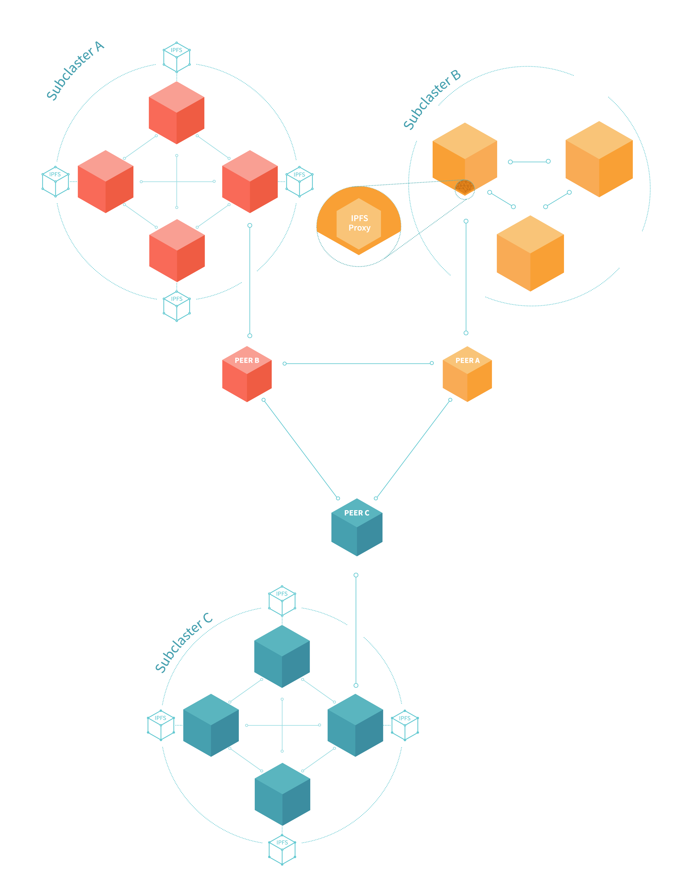

# 多集群通信




ipfs-cluster-service 提供了对 ipfs 节点的代理功能，使得整个 cluster 可以对外当做一个 ipfs 节点一样来使用。

- 代理端口默认开在 9095
- 对一部分命令进行了封装，例如：`ipfs --api /ip4/127.0.0.1/tcp/9095 add myfile.txt`
- 对于没有进行封装的命令，将会穿透访问到 ipfs 节点本身，例如访问 `ipfs --api /ip4/127.0.0.1/tcp/9095 repo gc` 和访问 `ipfs repo gc` 效果一致。

### 常用命令

```
(1) ipfs --api /ip4/127.0.0.1/tcp/9095 add myfile.txt
    该命令将本地 myfile.txt 的内容添加到本地 IPFS 节点中，并且将文件对应的哈希值添加到集群中。

(2) ipfs --api /ip4/127.0.0.1/tcp/9095 pin add <cid>
    根据 cid 获取网络中对应的内容，写入本地 IPFS 节点，并且将该哈希值添加到集群中。
    
(3) ipfs --api /ip4/127.0.0.1/tcp/9095 pin rm <cid>
    将该 cid 记录从本集群中移除。

(4) ipfs --api /ip4/127.0.0.1/tcp/9095 pin ls 
    显示本集群中所有的 pin 记录。

(5) ipfs repo gc 
    该命令会触发 gc 操作，回收所有 unpin 的内容在 IPFS 节点中所占用的存储空间。
``` 


### 参考文献

https://cluster.ipfs.io/documentation/composite-clusters/
