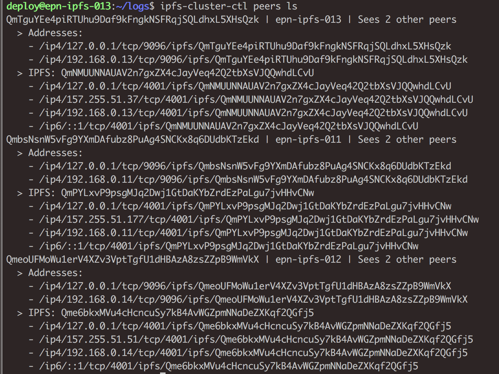
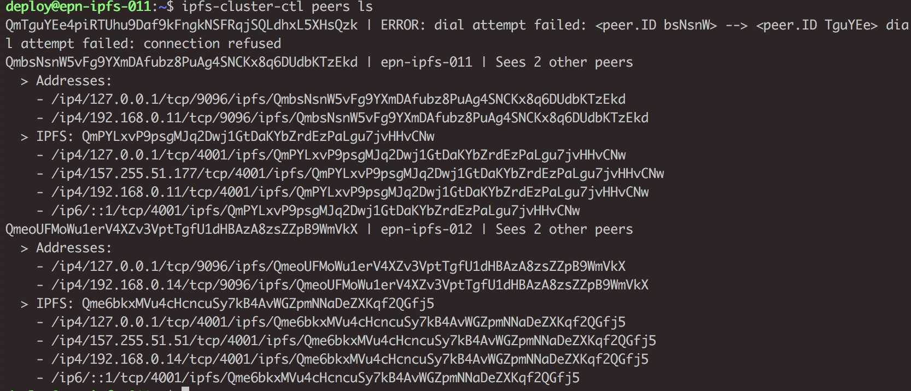

# 实验：集群节点故障

- 配置并运行集群 cluster-a ，该集群有 epn-ipfs-011，epn-ipfs-012 两个节点
- 添加一个新的节点 epn-ipfs-013，使用 bootstrap 的方式加入集群 cluster-a
- 新节点加入后运行  ‘ipfs-cluster-ctl peers ls’ 可以看到集群中已经有三个节点，如下图

- 将 epn-ipfs-013 的 ipfs-cluster-service 服务关闭，然后在 epn-ipfs-011 中运行 `ipfs-cluster-ctl peers ls` 会出现如下连接错误提示

虽然出现了连接错误提示，但是该集群依然可以进行正常的工作（例如：pin，add 等操作都正常）。如果希望避免这种错误提示，让节点出现故障后自动从集群中移除，那么可以设置 `leave_on_shutdown` 为 true。