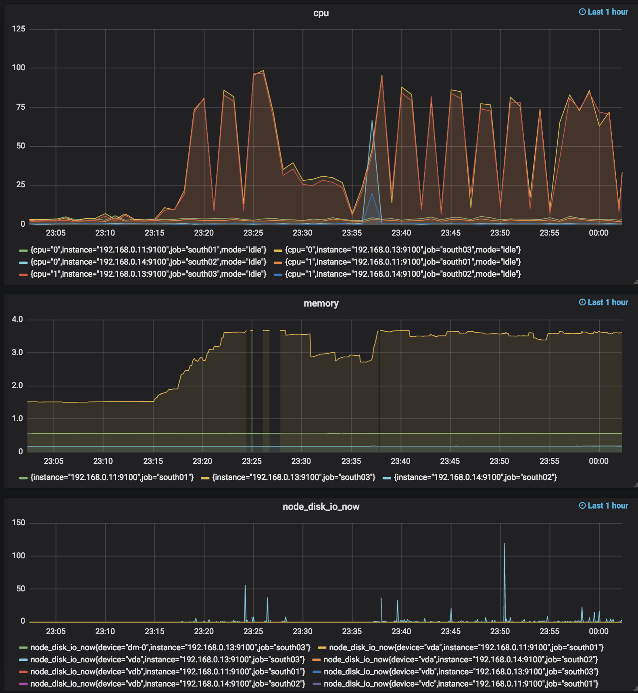

# 实验: IPFS Cluster 多并发 pin add 操作

## 实验设施 

- 使用 ipfs-cluster 在华南区配置两个集群。集群 A 包含 south01, south02, south03 这三台机器。集群 B 包含 south04 这一台机器。
- 四台机器的配置皆为： 2核 4G内存  5M带宽。
- 通过设置 IPFS_PATH 环境变量使 IPFS 文件存储在一个 100G 的磁盘上。
- 在 south04 上运行 Prometheus，在 south01、south02、south03 三台中运行 node_exporter。 Prometheus 每 5s 抓取一次 node_exporter 数据。
- 监控图形界面采用 grafana 展示
- 监控的指标为
    - cpu 使用率，查询语句为： `(1-irate(node_cpu_seconds_total{mode="idle"}[1m])) * 100`
    - 内存使用量，查询语句为：  `(node_memory_MemTotal_bytes - node_memory_Buffers_bytes - node_memory_Cached_bytes - node_memory_MemFree_bytes)/ 1024 / 1024 / 1024`
    - 磁盘 IO，查询语句为：`node_disk_io_now`

## 实验步骤

- Step 1. 在 south04 上使用 [gowrite 工具](https://github.com/csxuejin/gowrite) 创建不同大小的文件
- Step 2. 在 south04 上使用 [ipfstools 工具](https://github.com/csxuejin/ipfstools) 进行 ipfs cluster add 操作，并且生成记录文件哈希的文件 filehashes.
- Step 3. 将 filehashes 文件拷贝到 south01 上
- Step 4. 在 south01 上使用 [ipfstools 工具](https://github.com/csxuejin/ipfstools) 进行 ipfs cluster pin add 操作

> 在进行 pin add 操作的时候，控制并发数，借此观察并发数增加的情况下 CPU，内存和磁盘 IO 的变化。

### 实验结果

|  文件大小 | 文件数 | 并发数 | CPU 使用率 |
| :-: | :-: | :-: | :-: |
| 4M |  200 |  200 |  |
| 4M | 500 | 500 |  |
| 2G | 10 | 10 |  | 
| 10G | 3 | 3 |   |

### 实验结论
- IPFS Cluster 对 CPU 和内存要求较高，从图中可以看出，并发数增多或者文件较大的情况下 CPU 和内存使用率都接近 100%。
- IPFS Cluster 对磁盘 IO 的要求并不高
